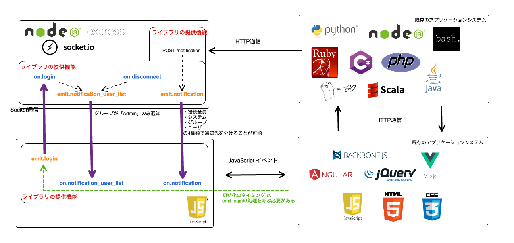

# WebSocketNotification 

BRIGHT VIEで利用しているWebSocketを利用したNotification Librayです。<br>
WebSocketでは、通常 Socket.idを利用してユーザを特定しメッセージのやりとりを行うが、<br>
アプリケーション側で管理しているユーザとWebSocket側のユーザをマッピングさせ<br>
メッセージのやりとりを簡単に行うことを目的に作成したライブラリとなります。<br>


## 機能

このライブラリには、大きく2つの機能があります。

### WebSocket ユーザ管理

WebSocketのユーザ管理では、コネクションを貼ったときのSocket.idとクライアントから送られてくるユーザ情報（userIdやgroupの情報）を紐付ける役割を担う。

### WebSocket Notigication

WebSocket経由で接続しているクライアントにメッセージを送る機能である。<br>
WebSocketサーバに対してAPIでメッセージを呼び出すことが出来るため、<br>
前述のユーザ管理機能とあわせて、アプリケーション側で管理するユーザ情報やグループの情報を用いて通知を行うことが可能である。<br>

## システム構成図



このライブラリでは、図の左側部分の機能を提供し、既存システムにおいてサーバからクライアントに対して何かを通知し処理を行いたい場合に
効率よく実装できるための仕組みを提供します。


## 実装

### サーバサイド

このライブラリは、Node.js(v6.11.0)及びExpressフレームワークを利用したサーバで組み込むことが可能である。

* package.jsonにライブラリの読み込み設定を記載

   ```
     "dependencies":{
        "websocket-notification":"git@github.com:brightvie/webSocketNotification.git"
     },
   ```

* npmにてインストールを行う

   ```
   npm install
   ```

* ライブラリの読み込み

   ```
   var WebSocketNotification = require('websocket-notification');
   ```

* 利用方法

   ExpressとSocket.ioのNode.jsサーバに組み込みの実装例
   ```server.js
   var express = require('express');
   var app = express();
   var bodyParser = require('body-parser');
   var http = require('http').Server(app);
   var io = require('socket.io')(http);

   app.use(bodyParser.urlencoded({
     extended: true
   }));
   app.use(bodyParser.json());

   // ユーザ管理の仕組みの初期化も含めてここで実施
   var WebSocketNotification = require('websocket-notification');
   var webSocketNotification = new WebSocketNotification();

   io.on('connection', function(socket){

     // WebSocket Notification Libraryで標準で用意されているメソッドを付与する
     // - ユーザ管理: login, disconnect イベントの設定
     // - 通知: POST /notification APIの実装
     webSocketNotification.setMethod(io, socket, app);
   });
 
   http.listen(3000, function(){
     console.log('listening on *:3000');
   });
   ```


### クライアント

このライブラリは、socket.io-clientと組み合わせることで利用することが可能である。

* bower.jsonにライブラリの読み込み設定を記載

   ```
   "dependencies": {
     "webSocketNotification": "git@github.com:brightvie/webSocketNotification.git",
   }
   ```

* bowerにてインストールを行う

   ```
   bower install
   ```

* ライブラリの読み込み（HTMLに記載）

   ```
   <script src="/components/socket.io-client/dist/socket.io.js"></script>
   <script src="/components/webSocketNotification/src/client/client.js "></script>
   ```

* 利用方法

   ```
    <script src="/components/socket.io-client/dist/socket.io.js"></script>
    <script src="/components/webSocketNotification/src/client/client.js "></script>
    <script>
      var obj = {
        systemName: '所属するシステムID' // 任意、指定がない場合はサーバ側でdefalutsが指定される
        userId: 'ユーザのIDを指定',     // 任意、指定がない場合はサーバ側でsocket.idが指定される
        groups: ['所属するグループIDなどを指定'] // 任意、指定がない場合は空配列となる
      };

      // WebSocket Clientの初期化
      var client = new WebSocketNotificationClient();
      // 任意のパラメータをセットする
      client.setOptions(obj);
      // WebSocketのコネクションを貼る
      var webSocket = client.getInstance(io);
      
      // getInstanceで返ってくる値は、socket.io-clientのインスタンスであるため、
      // 通常のsocket.on('イベント名', function(){}); といった書き方が可能である

      // サーバから通知を受け取ったときの処理を定義する。（デフォルトは、console.logでレスポンスが表示されるのみ）
      webSocket.on('notification', function(res) {
        // TODO: ここに処理を記載
        // - Angularなどのフレームワークに対してイベントを発火し、任意の処理を行うのもよし
        // - ここにべた書きで実施したい処理を行うのもよし
      });
    </script>
   ```

### 任意のイベントの発火方法

サーバとクライアントの準備ができたら、次に指定したターゲットに対して送信する方法を下記に記載する。<br>
WebSocketのイベントを発火する方法は、WebSocketサーバの「/notification」 URLに対してPOSTでリクエストを送ることで可能である。<br>

APIのパラメータは下記の３種類

- sendType
   - 送信対象を指定する
      - all: 接続してる全ユーザに対して通知する
      - system: 所属しているシステムのユーザに対して通知する
      - group: 所属しているグループのユーザに対して通知する
      - user: ユーザを指定して通知する
- target:
   - sentTypeで指定した送信対象を記載する。（配列で送信する）
      - allの場合は指定する必要はない
- message: JSON形式の文字列
   - このJSONオブジェクトが、クライアントに直接送信されるメッセージとなる

サンプルリクエスト

```
curl -X POST http://localhost:3000/notification -d '{"sentType": "user", "target": ["10001"], "message": {"statusCode": 200, "action": "alert"}}'
```
